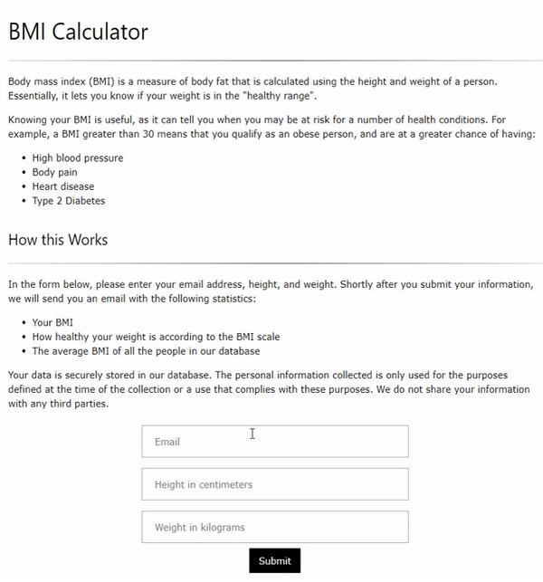
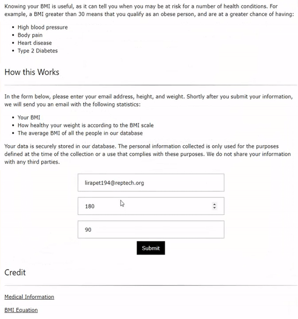
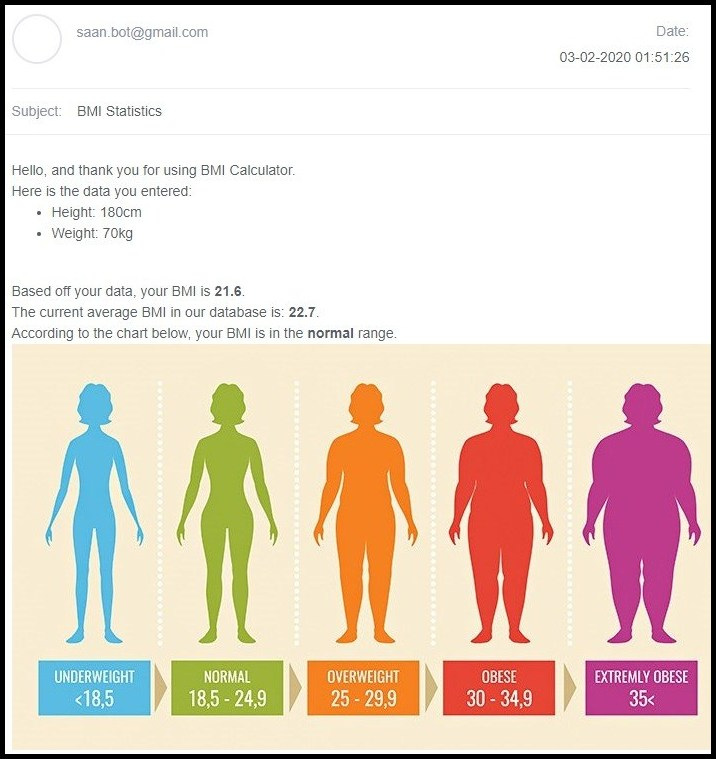

# BMI-Calculator
This repo is used to host my body mass index (BMI) calculator. I use Python and PostGreSQL to collect and store information from users in a database. The information collected includes the user's height, weight, and email address. 

Once the data is submitted, the user automatically receives an email that contains the following statistics: their calculated BMI, what their BMI means, and what the average BMI in the database is.

The site can be accessed at https://bmi-calculator-db.herokuapp.com/.

## Demo
Submitting data for the first time on an email:

Updating info for the same email:

Email received by user:

## Built With
* [PostGreSQL](https://www.postgresql.org/) - This project's relational database
* [Smtplib](https://docs.python.org/3/library/smtplib.html) - Defines an SMTP session that can be used to send emails
* [Flask](http://flask.palletsprojects.com/en/1.1.x/) - Micro web framework for Python
* [Heroku](https://dashboard.heroku.com/auth/heroku/callback?code=b335d296-669a-4f76-a9fa-5132c97d42c7) - Cloud platform that the site was deployed on

## Acknowledgments
Knowing your BMI is a great and simple way to understand your physical condition. so I created this project with the hope that it will help people stay healthy.

I'd also like to thank my good friend, Arjav Patel, for helping me debug this project. Check out his Linkedin profile at https://www.linkedin.com/in/arjav-patel/!
